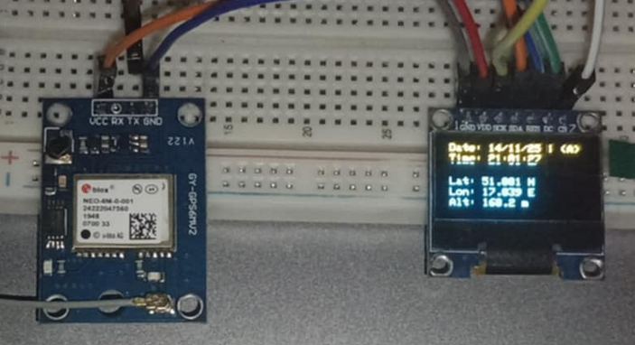

# STM32 + GPS NEO-6M + OLED SSD1306 (SPI)  
## Projekt wyświetlacza danych GPS (czas, pozycja, wysokość)

Projekt realizuje odczyt danych z modułu GPS **GY-NEO6MV2** poprzez UART oraz prezentację najważniejszych parametrów na wyświetlaczu **OLED 0,96" SSD1306 128×64** sterowanym przez **SPI**.

Wyświetlane są:
- Data (DD/MM/YY)
- Czas UTC
- Status fix'a (A/V)
- Szerokość geograficzna (Lat)
- Długość geograficzna (Lon)
- Wysokość nad poziomem morza (Alt)
- Liczba satelitów (opcjonalnie)
- Prędkość (opcjonalnie)

---

## 📡 Użyte moduły

### **1. Wyświetlacz OLED 0,96″ 128×64 I2C/SPI (SSD1306)**  
- Rozdzielczość: **128×64 px**  
- Kontroler: **SSD1306**  
- Zasilanie: **3.3–5V**  
- Sterowanie: w projekcie użyto **SPI**  
- Moduł działa natychmiast po podłączeniu  
- Dostępne liczne biblioteki i przykłady

### **2. Moduł GPS GY-NEO6MV2**
- Zasilanie: **3.3–5V**
- Logika UART: **3.3V** (5V niszczy moduł)
- Pobór mocy: 33-111 mW  
- Szybkości transmisji: 4800–115200 baud (domyślnie 9600)
- Czas ustalenia pozycji:
  - Zimny start: 27 s  
  - Ciepły start: < 3 s  
  - Gorący start: 1 s  
- Odczytywane informacje:
  - współrzędne GPS  
  - wysokość  
  - prędkość  
  - liczba satelitów  
  - data i czas UTC (może zastąpić RTC)

Moduł posiada:
- Antenę ceramiczną 25×25 mm  
- Baterię podtrzymującą  
- EEPROM do zapisu konfiguracji  

---

## 🧩 Połączenia sprzętowe

### **STM32 → OLED SSD1306 (SPI)**

| STM32 | OLED SSD1306 |
|-------|--------------|
| PA4   | CS           |
| PA5   | SCK          |
| PA7   | SDA (MOSI)   |
| PB0   | DC           |
| PB6   | RESET        |
| GND   | GND          |
| 5V    | VCC          |

---

### **STM32 → GPS GY-NEO6MV2 (UART)**

| STM32 | GPS |
|-------|-----|
| PA3   | TX  |
| GND   | GND |
| 5V → VCC | (bezpieczne – moduł ma stabilizator) |

⚠️ Logika GPS to **3.3V**, ale odbieramy tylko TX → RX, co jest bezpieczne.  
Modułu **nie wolno** podłączać 5V do linii logicznych!

---

## 🧪 Testowanie – symulacja ramek GPS przez ESP32

Do testów stworzono generator ramek NMEA na **ESP32**, podłączony do STM32 przez UART.  
Pozwoliło to na:
- debug bez wychodzenia na zewnątrz,
- analizę parsera,
- zasymulowanie pełnego strumienia NMEA.

Przykładowy zestaw ramek testowych GPS wraz z opisem danych:
```text
$GPRMC,185919.00,A,4107.038,N,01131.000,E,0.5,45.2,141125,,,A6C
$GPVTG,45.2,T,,M,0.5,N,0.9,K,A23
$GPGGA,185919.00,4107.038,N,01131.000,E,1,08,0.9,545.4,M,46.9,M,,47
$GPGSA,A,3,04,05,09,12,24,29,31,02,,,,,1.8,1.0,1.533
$GPGSV,2,1,08,04,67,045,39,05,56,123,40,09,45,250,35,12,32,175,3871
$GPGSV,2,2,08,24,25,067,30,29,20,310,28,31,15,180,25,02,10,040,2076
$GPGLL,4107.038,N,01131.000,E,185919.00,A,A*7C
```
RMC - Recommended Minimum Specific GPS/Transit Data
```text
$GPRMC,185919.00,A,4107.038,N,01131.000,E,0.5,45.2,141125,,,A6C
```
- Czas UTC: 18:59:19.00
- Status: A (aktywny)
- Szerokość: 41°07.038' N
- Długość: 11°31.000' E
- Prędkość: 0.5 węzła
- Kurs: 45.2°
- Data: 14/11/2025
- Suma kontrolna: A6C

GGA - Global Positioning System Fix Data
```text
$GPGGA,185919.00,4107.038,N,01131.000,E,1,08,0.9,545.4,M,46.9,M,,47
```
- Czas UTC: 18:59:19.00
- Szerokość: 41°07.038' N
- Długość: 11°31.000' E
- Status fix: 1 (GPS fix)
- Liczba satelitów: 8
- Dokładność HDOP: 0.9
- Wysokość nad poziomem morza: 545.4 m
- Geoid Separation: 46.9 m

---

## 🖥️ Przykładowy ekran – GPS



---

## 🖥️ Przykładowy ekran – symulacja ESP32


---

## 🧠 Opis działania programu

Program działa w oparciu o przerwania UART, które odbierają dane NMEA znak po znaku. Po odebraniu pełnej linii (zakończonej `\r\n`) następuje:

1. **Identyfikacja ramki** – sprawdzenie prefiksu (`$GPGGA`, `$GPRMC` itd.).
2. **Parsowanie informacji**  
   - `$GPGGA` → szerokość, długość, ilość satelitów, wysokość  
   - `$GPRMC` → czas UTC, data, status fix (A/V), prędkość  
3. **Konwersja współrzędnych** z formatu NMEA (ddmm.mmmm) na stopnie dziesiętne.  
4. **Aktualizacja danych wyświetlacza** – co 100 ms odświeżane są linie tekstu na OLED.  

Dodatkowo kod:
- formatuje czas, np. `185919.00 → 18:59:19`
- zamienia jednostki prędkości: węzły → km/h
- ustawia znak półkuli (N/S, E/W)
- automatycznie odróżnia aktywny/nieaktywny fix GPS

---
## 🧩 Fragmenty kodu – inicjalizacja OLED i przerwanie UART
```c
// RESET fizyczny
HAL_GPIO_WritePin(SSD1306_RESET_GPIO_Port, SSD1306_RESET_Pin, GPIO_PIN_RESET);
HAL_Delay(50);
HAL_GPIO_WritePin(SSD1306_RESET_GPIO_Port, SSD1306_RESET_Pin, GPIO_PIN_SET);
HAL_Delay(50);

// Inicjalizacja OLED
SSD1306_SpiInit(&hspi1);
SSD1306_Init();
SSD1306_Clear(BLACK);
SSD1306_Display();

// Start odbioru UART w trybie przerwań
HAL_UART_Receive_IT(&huart2, &rx_byte, 1);
```
```c
void HAL_UART_RxCpltCallback(UART_HandleTypeDef *huart)
{
    if(huart->Instance == USART2) {
        // Sprawdzamy, czy odebrany bajt to nie koniec linii (\n, \r)
        if(rx_byte != '\n' && rx_byte != '\r') {
            if(gps_idx < GPS_BUFFER_SIZE - 1) {
                gps_buffer[gps_idx++] = rx_byte; // Dopisywanie bajtu do bufora
            }
        } else {
            // Odebrano znak końca linii:
            if(gps_idx > 0) { // Mamy jakieś dane w buforze
                gps_buffer[gps_idx] = '\0'; // Zamykamy string (NULL-terminator)
                gps_line_ready = 1;         // Ustawiamy flagę gotowości dla pętli głównej
                gps_idx = 0;
            }
        }
        // Ponowne włączenie nasłuchiwania na pojedynczy bajt (kluczowe!)
        HAL_UART_Receive_IT(&huart2, &rx_byte, 1);
    }
}
```
## 🧩 Fragmenty kodu – pętla główna
```c
// Wewnątrz while (1)
while (1)
{
    SSD1306_Clear(BLACK);

    // 1. Parsowanie: ZAWSZE parsuj i aktualizuj dane globalne, jeśli przyszła nowa ramka
    if (gps_line_ready) {
        gps_line_ready = 0;

        // Identyfikacja ramki NMEA i wywołanie odpowiedniego parsera
        if (strncmp(gps_buffer, "$GPGGA", 6) == 0) {
            parseGGA(gga_buffer);
        }
        else if (strncmp(gps_buffer, "$GPRMC", 6) == 0) {
            parseRMC(rmc_buffer);
        }
    }

    // 2. Formatowanie i przygotowanie tekstu na wyświetlacz
    formatAndDisplayData(lines);

    // 3. Wyświetlanie: Rysowanie sformatowanych linii
    for (int i = 0; i < MAX_LINES; i++) {
        if (lines[i][0] != '\0') {
            GFX_DrawString(0, i * 10, lines[i], WHITE, BLACK);
        }
    }

    SSD1306_Display();
    HAL_Delay(100);
}
```
## 🧩 Fragmenty kodu – parsowanie i obróbka danych
### Konwersja współrzędnych NMEA → stopnie dziesiętne

```c
float convertNMEAToDecimal(const char* nmea)
{
    // Konwersja całej wartości NMEA (np. 4107.038) na float.
    float val = atof(nmea);
    
    // 1. Wyodrębnienie stopni (część całkowita przed minutami). 
    // Dzielenie przez 100 przesuwa kropkę: 4107.038 / 100.0f = 41.07038
    // Rzutowanie na int bierze część całkowitą: 41
    int degrees = (int)(val / 100.0f);
    
    // 2. Wyodrębnienie minut. 
    // Odjęcie stopni * 100: 4107.038 - (41 * 100) = 4107.038 - 4100.0f = 7.038
    float minutes = val - degrees * 100.0f;
    
    // 3. Konwersja i zwrot.
    // Wzór: Stopnie dziesiętne = Stopnie + (Minuty / 60)
    // 41 + (7.038 / 60.0f) = 41.1173
    return degrees + minutes / 60.0f;
}
```

### Parsowanie ramki GGA (pozycja, wysokość)
```c
void parseGGA(const char* line)
{
    // Kopiujemy oryginalną linię, ponieważ funkcja strtok() modyfikuje string wejściowy.
    char copy[GPS_BUFFER_SIZE];
    strcpy(copy, line);

    char *token;
    int field_idx = 0; // Licznik pól, zaczyna od 0 ($GPGGA)

    // Dzielimy string na tokeny (pola) za pomocą przecinka jako separatora.
    token = strtok(copy, ",");
    while(token != NULL) {
        switch(field_idx) {
            // Pole 2: Szerokość geograficzna NMEA (ddmm.mmmm)
            case 2: latitude = convertNMEAToDecimal(token); break;
            
            // Pole 3: Kierunek N/S. Jeśli "S" (Południe), ustawiamy wartość ujemną.
            case 3: 
                // Zapisujemy znak kierunku dla wyświetlenia (nawet jeśli już jest ujemna)
                ns = token[0]; 
                if(ns == 'S') latitude = -latitude; 
                break;
            
            // Pole 4: Długość geograficzna NMEA (dddmm.mmmm)
            case 4: longitude = convertNMEAToDecimal(token); break;
            
            // Pole 5: Kierunek E/W. Jeśli "W" (Zachód), ustawiamy wartość ujemną.
            case 5: 
                // Zapisujemy znak kierunku dla wyświetlenia
                ew = token[0];
                if(ew == 'W') longitude = -longitude; 
                break;
                
            // Pole 7: Liczba użytych satelitów (do wyliczenia pozycji)
            case 7: satellites = atoi(token); break;
            
            // Pole 9: Wysokość anteny nad poziomem morza (w metrach)
            case 9: altitude = atof(token); break;
            
            // Inne pola (czas, jakość fix, HDOP, separacja geoidy) są ignorowane lub parsowane w RMC
            default:
                break; 
        }
        
        field_idx++;
        token = strtok(NULL, ","); // Przechodzimy do następnego tokena
    }
}
```

### Parsowanie ramki RMC (czas, prędkość, data, status)
```c
void parseRMC(const char* line)
{
    // Kopiujemy linię, by nie modyfikować oryginalnego bufora.
    char copy[GPS_BUFFER_SIZE];
    strcpy(copy, line);

    char *token = strtok(copy, ",");
    int field_idx = 0;

    while(token != NULL) {
        switch(field_idx) {
            // Pole 1: Czas UTC (hhmmss.sss). Przechowujemy go w time_field.
            case 1: 
                strncpy(time_field, token, 10); 
                time_field[10] = '\0'; // Zapewnienie null-terminatora
                break;

            // Pole 2: Status A/V. 'A' (Active) = Fix jest ważny.
            case 2: 
                fix_valid = (token[0] == 'A'); 
                break;
                
            // Pole 7: Prędkość nad ziemią w węzłach (knots).
            case 7: 
                // Konwersja na float i przeliczenie na km/h (1 węzeł ≈ 1.852 km/h)
                speed_knots = atof(token);
                speed_kmh = speed_knots * 1.852f;
                break;

            // Pole 9: Data (DDMMYY). Przechowujemy ją w date_field.
            case 9: 
                strncpy(date_field, token, 6); 
                date_field[6] = '\0'; // Zapewnienie null-terminatora
                break;
        }

        token = strtok(NULL, ",");
        field_idx++;
    }
}
```


### Wyświetlanie danych na OLED SSD1306 w 6 liniach

```c
// Zakładamy, że formatowanie daty (date_field -> formatted_date)
// oraz czasu (time_field -> formatted_time) zostało wykonane wcześniej.

// Linia 0: Data i Status Fix (np. Date: 14/11/25 | (A))
char *fix_status = fix_valid ? "(A)" : "(V)";
sprintf(lines[0], "Date: %s | %s", formatted_date, fix_status);

// Linia 1: Czas (np. Time: 18:59:19)
sprintf(lines[1], "Time: %s", formatted_time);

// Linia 2: Prędkość i Liczba Satelitów (np. Sat: 08 Spd: 0.9 km/h)
sprintf(lines[2], "Sat: %d Spd: %.1f km/h", satellites, speed_kmh);

if (satellites > 0) {
    // Linia 3: Szerokość Geograficzna (np. Lat: 41.117 N)
    sprintf(lines[3], "Lat: %.3f %c", fabsf(latitude), ns);
    
    // Linia 4: Długość Geograficzna (np. Lon: 11.517 E)
    sprintf(lines[4], "Lon: %.3f %c", fabsf(longitude), ew);
    
    // Linia 5: Wysokość n.p.m. (np. Alt: 545.4 m)
    sprintf(lines[5], "Alt: %.1f m", altitude);
} else {
    // Linia 3 (jeśli brak fixa)
    sprintf(lines[3], "Waiting for data...");
}
```

