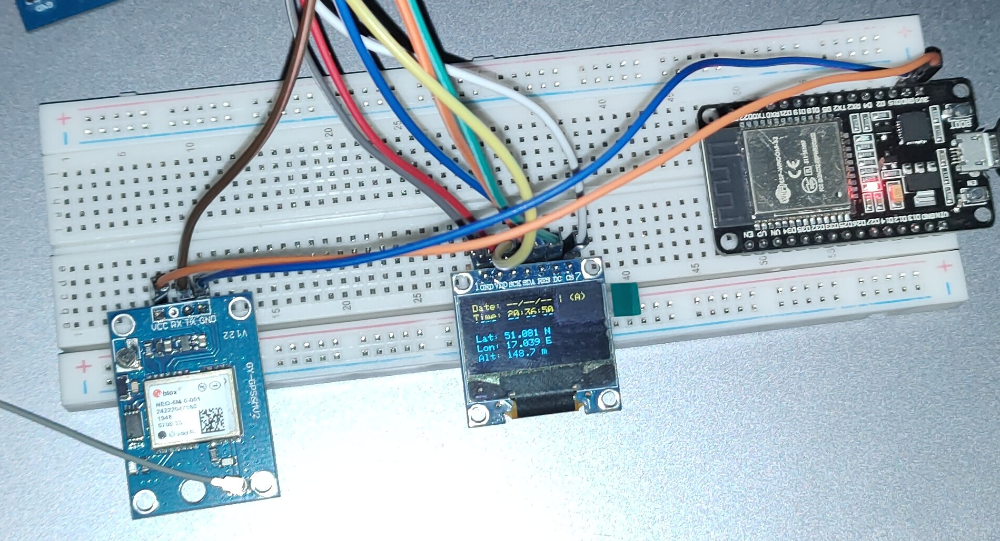
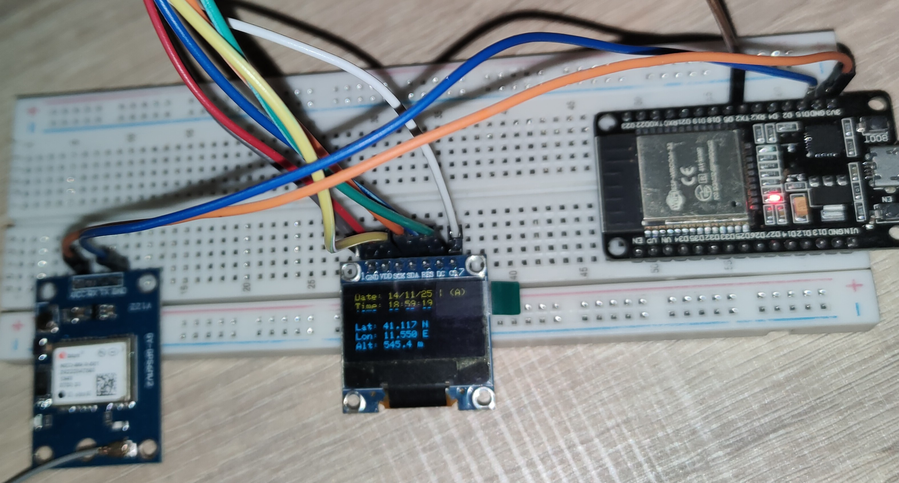

# STM32 + GPS NEO-6M + OLED SSD1306 (SPI)  
## Projekt wyświetlacza danych GPS (czas, pozycja, wysokość)

Projekt realizuje odczyt danych z modułu GPS **GY-NEO6MV2** poprzez UART oraz prezentację najważniejszych parametrów na wyświetlaczu **OLED 0,96" SSD1306 128×64** sterowanym przez **SPI**.

Wyświetlane są:
- Czas UTC
- Status fix'a (A/V)
- Szerokość geograficzna
- Długość geograficzna
- Wysokość nad poziomem morza
- Liczba satelitów (opcjonalnie)
- Prędkość (opcjonalnie)

---

## 📡 Użyte moduły

### **1. Wyświetlacz OLED 0,96″ 128×64 I2C/SPI (SSD1306)**  
- Rozdzielczość: **128×64 px**  
- Kontroler: **SSD1306**  
- Zasilanie: **3.3–5V**  
- Sterowanie: w projekcie użyto **SPI**  
- Moduł działa natychmiast po podłączeniu  
- Dostępne liczne biblioteki i przykłady

### **2. Moduł GPS GY-NEO6MV2**
- Zasilanie: **3.3–5V**
- Logika UART: **3.3V** (5V niszczy moduł)
- Pobór mocy: 33-111 mW  
- Szybkości transmisji: 4800–115200 baud (domyślnie 9600)
- Czas ustalenia pozycji:
  - Zimny start: 27 s  
  - Ciepły start: < 3 s  
  - Gorący start: 1 s  
- Odczytywane informacje:
  - współrzędne GPS  
  - wysokość  
  - prędkość  
  - liczba satelitów  
  - data i czas UTC (może zastąpić RTC)

Moduł posiada:
- Antenę ceramiczną 25×25 mm  
- Baterię podtrzymującą  
- EEPROM do zapisu konfiguracji  

---

## 🧩 Połączenia sprzętowe

### **STM32 → OLED SSD1306 (SPI)**

| STM32 | OLED SSD1306 |
|-------|--------------|
| PA4   | CS           |
| PA5   | SCK          |
| PA7   | SDA (MOSI)   |
| PB0   | DC           |
| PB6   | RESET        |
| GND   | GND          |
| 5V    | VCC          |

---

### **STM32 → GPS GY-NEO6MV2 (UART)**

| STM32 | GPS |
|-------|-----|
| PA3   | TX  |
| GND   | GND |
| 5V → VCC | (bezpieczne – moduł ma stabilizator) |

⚠️ Logika GPS to **3.3V**, ale odbieramy tylko TX → RX, co jest bezpieczne.  
Modułu **nie wolno** podłączać 5V do linii logicznych!

---

## 🧪 Testowanie – symulacja ramek GPS przez ESP32

Do testów stworzono generator ramek NMEA na **ESP32**, podłączony do STM32 przez UART.  
Pozwoliło to na:
- debug bez wychodzenia na zewnątrz,
- analizę parsera,
- zasymulowanie pełnego strumienia NMEA.

Przykładowy zestaw ramek testowych:
$GPRMC,185919.00,A,4107.038,N,01131.000,E,0.5,45.2,141125,,,A6C
$GPVTG,45.2,T,,M,0.5,N,0.9,K,A23
$GPGGA,185919.00,4107.038,N,01131.000,E,1,08,0.9,545.4,M,46.9,M,,47
$GPGSA,A,3,04,05,09,12,24,29,31,02,,,,,1.8,1.0,1.533
$GPGSV,2,1,08,04,67,045,39,05,56,123,40,09,45,250,35,12,32,175,3871
$GPGSV,2,2,08,24,25,067,30,29,20,310,28,31,15,180,25,02,10,040,2076
$GPGLL,4107.038,N,01131.000,E,185919.00,A,A*7C


---

## 🖥️ Przykładowy ekran – GPS



---

## 🖥️ Przykładowy ekran – symulacja ESP32



---

## 🧠 Opis działania programu

Program działa w oparciu o przerwania UART, które odbierają dane NMEA znak po znaku. Po odebraniu pełnej linii (zakończonej `\r\n`) następuje:

1. **Identyfikacja ramki** – sprawdzenie prefiksu (`$GPGGA`, `$GPRMC` itd.).
2. **Parsowanie informacji**  
   - `$GPGGA` → szerokość, długość, ilość satelitów, wysokość  
   - `$GPRMC` → czas UTC, data, status fix (A/V), prędkość  
3. **Konwersja współrzędnych** z formatu NMEA (ddmm.mmmm) na stopnie dziesiętne.  
4. **Aktualizacja danych wyświetlacza** – co 100 ms odświeżane są linie tekstu na OLED.  

Dodatkowo kod:
- formatuje czas, np. `185919.00 → 18:59:19`
- zamienia jednostki prędkości: węzły → km/h
- ustawia znak półkuli (N/S, E/W)
- automatycznie odróżnia aktywny/nieaktywny fix GPS

---

## 🧩 Fragmenty kodu – parsowanie i obróbka danych

### Konwersja współrzędnych NMEA → stopnie dziesiętne

```c
float convertNMEAToDecimal(const char* nmea)
{
    float val = atof(nmea);
    int degrees = (int)(val / 100.0f);
    float minutes = val - degrees * 100.0f;
    return degrees + minutes / 60.0f;
}
```

### Parsowanie ramki GGA (pozycja, wysokość)
```c
void parseGGA(const char* line)
{
    char copy[GPS_BUFFER_SIZE];
    strcpy(copy, line);

    char *token = strtok(copy, ",");
    int field_idx = 0;

    while(token != NULL) {
        switch(field_idx) {
            case 2: latitude = convertNMEAToDecimal(token); break;
            case 3: if(token[0]=='S') latitude = -latitude; break;
            case 4: longitude = convertNMEAToDecimal(token); break;
            case 5: if(token[0]=='W') longitude = -longitude; break;
            case 7: satellites = atoi(token); break;
            case 9: altitude = atof(token); break;
        }
        token = strtok(NULL, ",");
        field_idx++;
    }
}
```

### Parsowanie ramki RMC (czas, prędkość, data, status)
```c
void parseRMC(const char* line)
{
    char copy[GPS_BUFFER_SIZE];
    strcpy(copy, line);

    char *token = strtok(copy, ",");
    int field_idx = 0;

    while(token != NULL) {
        switch(field_idx) {
            case 1: strncpy(time_field, token, 10); break;
            case 2: fix_valid = (token[0]=='A'); break;
            case 7: speed_kmh = atof(token) * 1.852f; break;
            case 9: strncpy(date_field, token, 6); break;
        }
        token = strtok(NULL, ",");
        field_idx++;
    }
}
```


### Wyświetlanie danych na OLED SSD1306 w 5 liniach
```c
sprintf(lines[0], "UTC: %s | %s", formatted_time, fix_valid ? "(A)" : "(V)");
sprintf(lines[1], "SAT: %02d | SPD: %.1f", satellites, speed_kmh);
sprintf(lines[2], "Lat: %.3f %c", fabsf(latitude), ns);
sprintf(lines[3], "Lon: %.3f %c", fabsf(longitude), ew);
```
sprintf(lines[4], "Alt: %.1f m", altitude);

